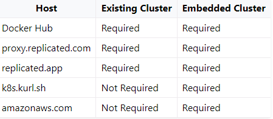

# [연구장학생] XAI 8월 자료 정리

# Arthur AI 시스템 구성 + 설치 요구사항

## 시스템 구성

1. Performance Monitoring Dashboard : 
    - 모델의 세부적인 성능을 모니터링하기 위해서 input data와 output data를 분석합니다.
    - 단변수, 다변수 data 뿐만 아니라 사용자 설정의 측정 항목(custom metrics)도 분석이 가능합니다.

2. Bias Dashboard :
    - 편차(Bias)를 탐지하고 분석하는 도구를 제공하여 공평한 예측을 가능하게 합니다.
    - Input data의 다양한 그룹 별 편차를 나눠서 분석 가능합니다.

3. Explainability tools
    - 모델의 예측에 대한 가시성(prediction-level visibility)을 제공하기 위해 강력한 설명 기술들을 사용합니다.
    - Feature 중요도 순위와 "what if" 분석 등을 제공할 수 있습니다.

4. Custom Alerting
    - 분석을 진행 중인 모델이 놓쳐서는 안되는 Issue들에 대해서 한계치(threshold)를 정해놓고 경고(alerts)를 설정할 수 있습니다.

5. API & SDK
    - 정해진 소프트웨어가 아닌 원하는 개발 환경에서 원하는 모든 Arthur AI의 기능들을 활용할 수 있습니다.

## 설치 요구사항

- 크게 설치 가능한 환경은 회사에서 제공하는 SaaS 배포판이나, 개인 CLOUD VPC, 그 외 환경들(K8 cluster, 가상머신, bare metal server)로 나누어지며, 모든 환경에서 Hostname과 TLS 개인 키, 증명서가 필요하다.

1. VM 설치 시 요구 사항 : 
    1. 16CPUs, 32G 램, 100G 이상 저장공간
    2. Ubuntu, RHEL 지원 (SELinux는 호환불가능).
    3. 포트 요구 사항
        - TCP ports 2379, 2380, 6443, 6783, 10250, 10251 and 10252 open between cluster nodes
        - UDP ports 6783 and 6784 open between cluster nodes

2. Pre-built Kubernetes 설치 시 요구 사항 :
    1. Kubernetes: 1.20, 1.19, or 1.18
    2. Runtime: containerd or Docker
    3. Namespace
    4. Storage class
    5. 최소 사양 : 16CPUs, 32G 램, 100G storage

3. 방화벽 설정
    1. TCP port 443 for the application

4. 호스트 별 설치 요구조건

    

# Monitoring 기능에 필요한 API+Parameter 정리

## **Model-related API**

- **models**
    - model
        - Arthur Model
        💡 deploy된 ML system과 data를 주고받기 위한 객체 (wrapper 역할)

            arthur model object는 3가지의 주요 parameter로 구성

            - `input_type`
                - Image, NLP, Tabular
            - `output_type`
                - Multiclass
                - Multilabel
                - Regression
                - Object Detection
                - Multiclass, Multilabel, Regression, Object Detection
            - `is_batch`
                - inference를 batch나 연속적인 data에 대해 얻을 수 있음
                - inference를 batch나 연속적인 data에 대해 얻을지 표시
            - `explanability` - explainability 설정
            - `id` - 자동 생성된 모델의 UUID
            - `display_name`
            - `partner_model_id` - 사용자가 지정하는 unique ID, 변경 불가
            - `description`
            - `archived`
            - `created_at`
            - `updated_at`
            - `attributes`
            - `tags`
            - `classifier threshold`
            - `text_delimiter`
        - Arthur Attribute
            - `Stage` - model inference 과정 중 어디에 쓰이는 attribute인지 나타냄
                - ModelPipelineInput, NonInputData, PredictedValue, GroundTruth
            - `Categorical`
                - categorical attribute → true
                - continuous attribute → false
                - unique attribute는 categorical attribute에 포함됨
            - `id` - 자동 생성된 UUID
            - `name`
            - `label`
            - `value_type` - enum : "BOOLEAN" "FLOAT" "IMAGE" "INTEGER" "STRING" "TIMESTAMP" "UNSTRUCTURED_TEXT"
            - `position`
            - `min_range`
            - `max_range`
            - `monitor_for_bias`
            - `categories`
            - `bins`
            - `is_unique`
            - `is_positive_predicted_attribute`
            - `attribute_link`
        - Artuhr Inference
            - inference를 위한 container class가 Arthur platform에 업로드
            - input features, prediction values, (optionally) ground truth values and any Non-Input data
    - `GET/POST` /models
    💡 **model 조회, 생성**
        - GET
            - *authorizations:* auth
            - *query parameter*
                - `include_archived` (boolean; default = false) archived model return 여부
                - `page` (integer; defult = 1)
                - `page_size` (integer)
                - `sort` (string)
            - *response*
                - `data` (array of objects) list of model object
                - `page` (integer; default = 1)
                - `page_size` (integer)
                - `total_pages` (integer)
                - `total_count` (integer)

            ```json
            {
              "data": [
                {
                  "explainability": {
                    "model_server_cpu": "string",
                    "model_server_memory": "string",
                    "explanation_nsamples": 0,
                    "explanation_algo": "string",
                    "enabled": true
                  },
                  "id": "string",
                  "display_name": "string",
                  "partner_model_id": "string",
                  "description": "string",
                  "input_type": "TABULAR",
                  "output_type": "MULTILABEL",
                  "is_batch": false,
                  "archived": true,
                  "created_at": "2019-08-24T14:15:22Z",
                  "updated_at": "2019-08-24T14:15:22Z",
                  "attributes": [
                    {
                      "id": "string",
                      "name": "string",
                      "label": "string",
                      "value_type": "BOOLEAN",
                      "stage": "GROUND_TRUTH",
                      "position": 0,
                      "categorical": false,
                      "min_range": 0,
                      "max_range": 0,
                      "monitor_for_bias": false,
                      "categories": [
                        {
                          "label": "string",
                          "value": "string"
                        }
                      ],
                      "bins": [
                        {
                          "continuous_start": 0,
                          "continuous_end": 0
                        }
                      ],
                      "is_unique": false,
                      "is_positive_predicted_attribute": false,
                      "attribute_link": "string"
                    }
                  ],
                  "tags": [
                    "string"
                  ],
                  "classifier_threshold": 0,
                  "text_delimiter": ","
                }
              ],
              "page": 1,
              "page_size": 0,
              "total_pages": 0,
              "total_count": 0
            }
            ```

        - POST
            - *authorizations:* auth
            - *request body schema*
                - `display_name` (string; ≤ 255 characters)
                - `partner_model_id` (string; ≤ 255 characters) unique, 변경 불가
                - `input_type` (string; enum : "IMAGE", "TABULAR", "NLP") 모델 input data의 type
                - `output_type` (string; enum : "MULTICLASS", "MULTILABEL", "REGRESSION")
                - `is_batch` (boolean)
                - `description` (string; ≤ 255 characters)
                - `attributes` (array of objects; non-empty)
                - `tags` (array of strings)
                - `classifier_threshold` (number; default = 0.5)
                - `text_delimiter` (string) input_type이 NLP일 때, input string을 나누기 위해 사용

                ```json
                {
                  "name": "v3_api_example",
                  "partner_model_id": "id_123",
                  "input_type": "TABULAR",
                  "output_type": "MULTILABEL",
                  "attributes": [
                    {
                      "name": "model_attribute_0",
                      "value_type": "BOOLEAN",
                      "stage": "PREDICT_FUNCTION_INPUT",
                      "position": 0
                    },
                    {
                      "name": "model_predicted_attr",
                      "value_type": "BOOLEAN",
                      "stage": "PREDICTED_VALUE"
                    }
                  ]
                }
                ```

            - *response*
                - `id` (string)
                - `display_name` (string; ≤ 255 characters)
                - `partner_model_id` (string; ≤ 255 characters)
                - `description` (string; ≤ 255 characters)
                - `input_type` (string; enum : "IMAGE", "TABULAR", "NLP")
                - `output_type` (string; enum : "MULTICLASS", "MULTILABEL", "REGRESSION")
                - `is_batch` (boolean)
                - `archived` (boolean)
                - `created_at` (string <date-time>)
                - `updated_at` (string <date-time>)
                - `attributes` (array of objects; non-empty)
                - `tags` (array of strings)
                - `classifier_threshold` (number)
                - `text_delimiter` (string)

                ```json
                {
                  "id": "string",
                  "display_name": "string",
                  "partner_model_id": "string",
                  "description": "string",
                  "input_type": "TABULAR",
                  "output_type": "MULTILABEL",
                  "is_batch": false,
                  "archived": true,
                  "created_at": "2019-08-24T14:15:22Z",
                  "updated_at": "2019-08-24T14:15:22Z",
                  "attributes": [
                    {
                      "id": "string",
                      "name": "string",
                      "label": "string",
                      "value_type": "BOOLEAN",
                      "stage": "GROUND_TRUTH",
                      "position": 0,
                      "categorical": false,
                      "min_range": 0,
                      "max_range": 0,
                      "monitor_for_bias": false,
                      "categories": [
                        {
                          "label": "string",
                          "value": "string"
                        }
                      ],
                      "bins": [
                        {
                          "continuous_start": 0,
                          "continuous_end": 0
                        }
                      ],
                      "is_unique": false,
                      "is_positive_predicted_attribute": false,
                      "attribute_link": "string"
                    }
                  ],
                  "tags": [
                    "string"
                  ],
                  "classifier_threshold": 0,
                  "text_delimiter": ","
                }
                ```

    - `GET/PUT/DEL` /models/{model_id}
    💡 **특정 model 조회, 수정, 삭제**
        - GET
            - *authorizations:* auth
            - *path parameter*
                - `model_id` (string)
            - *query parameter*
                - `id_type` (any; default = "id"; enum : "id", "partner_model_id")
                - `expand` (array of strings) 추가 정보 
                '?expand=explainability&expand=attributes'
            - *response*
                - `explainability` (object)
                - `id` (string)
                - `display_name` (string; ≤ 255 characters)
                - `partner_model_id` (string; ≤ 255 characters)
                - `description` (string; ≤ 255 characters)
                - `input_type` (string; enum : "IMAGE", "TABULAR", "NLP")
                - `output_type` (string; enum : "MULTICLASS", "MULTILABEL", "REGRESSION")
                - `is_batch` (boolean)
                - `archived` (boolean)
                - `created_at` (string <date-time>)
                - `updated_at` (string <date-time>)
                - `attributes` (array of objects; non-empty)
                - `tags` (array of strings)
                - `classifier_threshold` (number)
                - `text_delimiter` (string)

            ```json
            {
              "explainability": {
                "model_server_cpu": "string",
                "model_server_memory": "string",
                "explanation_nsamples": 0,
                "explanation_algo": "string",
                "enabled": true
              },
              "id": "string",
              "display_name": "string",
              "partner_model_id": "string",
              "description": "string",
              "input_type": "TABULAR",
              "output_type": "MULTILABEL",
              "is_batch": false,
              "archived": true,
              "created_at": "2019-08-24T14:15:22Z",
              "updated_at": "2019-08-24T14:15:22Z",
              "attributes": [
                {
                  "id": "string",
                  "name": "string",
                  "label": "string",
                  "value_type": "BOOLEAN",
                  "stage": "GROUND_TRUTH",
                  "position": 0,
                  "categorical": false,
                  "min_range": 0,
                  "max_range": 0,
                  "monitor_for_bias": false,
                  "categories": [
                    {
                      "label": "string",
                      "value": "string"
                    }
                  ],
                  "bins": [
                    {
                      "continuous_start": 0,
                      "continuous_end": 0
                    }
                  ],
                  "is_unique": false,
                  "is_positive_predicted_attribute": false,
                  "attribute_link": "string"
                }
              ],
              "tags": [
                "string"
              ],
              "classifier_threshold": 0,
              "text_delimiter": ","
            }
            ```

        - PUT
            - *authorizations:* auth
            - *path parameter*
                - `model_id` (string)
            - *query parameter*
                - `id_type` (any; default = "id"; enum : "id", "partner_model_id")
                - `expand` (array of strings) 추가 정보 
                '?expand=explainability&expand=attributes'
            - *request body schema*
                - `display_name` (string; ≤ 255 characters)
                - `description` (string; ≤ 255 characters)
                - `attributes` (array of objects) inference가 업데이트 된 후에는 ground truth attributes만 수정 가능
                - `tags` (array of strings)
                - `classifier_threshold` (number: default = 0.5) inference 보내지기 전에만 수정 가능

                ```json
                {
                  "display_name": "string",
                  "description": "string",
                  "attributes": [
                    {
                      "name": "string",
                      "label": "string",
                      "value_type": "BOOLEAN",
                      "stage": "GROUND_TRUTH",
                      "position": 0,
                      "categorical": false,
                      "min_range": 0,
                      "max_range": 0,
                      "monitor_for_bias": false,
                      "categories": [
                        {
                          "label": "string",
                          "value": "string"
                        }
                      ],
                      "bins": [
                        {
                          "continuous_start": 0,
                          "continuous_end": 0
                        }
                      ],
                      "is_unique": false,
                      "is_positive_predicted_attribute": false,
                      "attribute_link": "string"
                    }
                  ],
                  "tags": [
                    "string"
                  ],
                  "classifier_threshold": 0
                }
                ```

            - *response*
                - `explainability` (object)
                - `id` (string)
                - `display_name` (string; ≤ 255 characters)
                - `partner_model_id` (string; ≤ 255 characters)
                - `description` (string; ≤ 255 characters)
                - `input_type` (string; enum : "IMAGE", "TABULAR", "NLP")
                - `output_type` (string; enum : "MULTICLASS", "MULTILABEL", "REGRESSION")
                - `is_batch` (boolean)
                - `archived` (boolean)
                - `created_at` (string <date-time>)
                - `updated_at` (string <date-time>)
                - `attributes` (array of objects; non-empty)
                - `tags` (array of strings)
                - `classifier_threshold` (number)
                - `text_delimiter` (string)

                ```json
                {
                  "explainability": {
                    "model_server_cpu": "string",
                    "model_server_memory": "string",
                    "explanation_nsamples": 0,
                    "explanation_algo": "string",
                    "enabled": true
                  },
                  "id": "string",
                  "display_name": "string",
                  "partner_model_id": "string",
                  "description": "string",
                  "input_type": "TABULAR",
                  "output_type": "MULTILABEL",
                  "is_batch": false,
                  "archived": true,
                  "created_at": "2019-08-24T14:15:22Z",
                  "updated_at": "2019-08-24T14:15:22Z",
                  "attributes": [
                    {
                      "id": "string",
                      "name": "string",
                      "label": "string",
                      "value_type": "BOOLEAN",
                      "stage": "GROUND_TRUTH",
                      "position": 0,
                      "categorical": false,
                      "min_range": 0,
                      "max_range": 0,
                      "monitor_for_bias": false,
                      "categories": [
                        {
                          "label": "string",
                          "value": "string"
                        }
                      ],
                      "bins": [
                        {
                          "continuous_start": 0,
                          "continuous_end": 0
                        }
                      ],
                      "is_unique": false,
                      "is_positive_predicted_attribute": false,
                      "attribute_link": "string"
                    }
                  ],
                  "tags": [
                    "string"
                  ],
                  "classifier_threshold": 0,
                  "text_delimiter": ","
                }
                ```

        - DEL 
        💡 model object를 archiving
        💡 compute resource는 지우지만 delete inference data는 지우지 않음
        💡 model이 Arthur Dashboard에 보이지 않음
            - *authorizations:* auth
            - *path parameter*
                - `model_id` (string)
            - *query parameter*
                - `id_type` (any; default = "id"; enum : "id", "partner_model_id")
                - `expand` (array of strings) 추가 정보 
                '?expand=explainability&expand=attributes'
            - *response*
                - `explainability` (object)
                - `id` (string)
                - `display_name` (string; ≤ 255 characters)
                - `partner_model_id` (string; ≤ 255 characters)
                - `description` (string; ≤ 255 characters)
                - `input_type` (string; enum : "IMAGE", "TABULAR", "NLP")
                - `output_type` (string; enum : "MULTICLASS", "MULTILABEL", "REGRESSION")
                - `is_batch` (boolean)
                - `archived` (boolean)
                - `created_at` (string <date-time>)
                - `updated_at` (string <date-time>)
                - `attributes` (array of objects; non-empty)
                - `tags` (array of strings)
                - `classifier_threshold` (number)
                - `text_delimiter` (string)

                ```json
                {
                  "explainability": {
                    "model_server_cpu": "string",
                    "model_server_memory": "string",
                    "explanation_nsamples": 0,
                    "explanation_algo": "string",
                    "enabled": true
                  },
                  "id": "string",
                  "display_name": "string",
                  "partner_model_id": "string",
                  "description": "string",
                  "input_type": "TABULAR",
                  "output_type": "MULTILABEL",
                  "is_batch": false,
                  "archived": true,
                  "created_at": "2019-08-24T14:15:22Z",
                  "updated_at": "2019-08-24T14:15:22Z",
                  "attributes": [
                    {
                      "id": "string",
                      "name": "string",
                      "label": "string",
                      "value_type": "BOOLEAN",
                      "stage": "GROUND_TRUTH",
                      "position": 0,
                      "categorical": false,
                      "min_range": 0,
                      "max_range": 0,
                      "monitor_for_bias": false,
                      "categories": [
                        {
                          "label": "string",
                          "value": "string"
                        }
                      ],
                      "bins": [
                        {
                          "continuous_start": 0,
                          "continuous_end": 0
                        }
                      ],
                      "is_unique": false,
                      "is_positive_predicted_attribute": false,
                      "attribute_link": "string"
                    }
                  ],
                  "tags": [
                    "string"
                  ],
                  "classifier_threshold": 0,
                  "text_delimiter": ","
                }
                ```

    - `GET/PUT/PATCH/DEL` /models/{model_id}/attributes
    💡 **model attributes 조회, 수정, 삭제**
        - GET
            - *authorizations:* auth
            - *path parameter*
                - `model_id` (string)
            - *query parameter*
                - `page` (integer; default = 1)
                - `page_size` (integer)
                - `sort` (string)
            - *responses schema*
                - `data` (array of objects)
                - `page`
                - `page_size`
                - `total_pages`
                - `total_count`

                ```json
                {
                  "data": [
                    {
                      "id": "string",
                      "name": "string",
                      "label": "string",
                      "value_type": "BOOLEAN",
                      "stage": "GROUND_TRUTH",
                      "position": 0,
                      "categorical": false,
                      "min_range": 0,
                      "max_range": 0,
                      "monitor_for_bias": false,
                      "categories": [
                        {
                          "label": "string",
                          "value": "string"
                        }
                      ],
                      "bins": [
                        {
                          "continuous_start": 0,
                          "continuous_end": 0
                        }
                      ],
                      "is_unique": false,
                      "is_positive_predicted_attribute": false,
                      "attribute_link": "string"
                    }
                  ],
                  "page": 1,
                  "page_size": 0,
                  "total_pages": 0,
                  "total_count": 0
                }
                ```

        - PUT
        model attribute 수정
        inference를 가지고 있다면 attribute label, category labels만 수정가능
            - *authorizations:* auth
            - *path parameter*
                - `model_id` (string)
            - *request body schema*
                - Array of the model attributes to update or add (ModelAttributeReques or ModelAttributeResponse)
            - *response*
                - 204 - the attributes were successfully updated
        - PATCH
        model attribute 일부 수정
        inference를 가지고 있다면 attribute label, category labels만 수정가능
            - *authorizations:* auth
            - *path parameter*
                - `model_id` (string)
            - *request body schema*
                - Array of the model attributes to update or add (ModelAttributeReques or ModelAttributeResponse)
            - *response*
                - 204 - the attributes were successfully updated
        - DEL
            - *authorizations:* auth
            - *path parameter*
                - `model_id` (string)
            - *response*
                - 204 - the attributes were successfully updated
    - `GET/PUT/DEL` /models/{model_id}/attributes/{attribute_id}
    💡 **특정 model attribute 조회, 수정, 삭제**
        - GET
            - *authorizations:* auth
            - *path parameter*
                - `model_id` (string)
                - `attribute_id` (string)
            - *response schema*
                - `id` (string)
                - `name` (string; ≤ 255 characters)
                - `label` (string; ≤ 255 characters)
                - `value_type` (string; enum : "BOOLEAN" "FLOAT" "IMAGE" "INTEGER" "STRING" "TIMESTAMP" "UNSTRUCTURED_TEXT")
                - `stage` (string; enum : "GROUND_TRUTH" "NON_INPUT_DATA" "PIPELINE_INPUT" "PREDICTED_VALUE" "PREDICT_FUNCTION_INPUT")
                - `position` (integer; ≥ 0)
                - `categorical` (boolean; default = false)
                - `min_range` (integer or number)
                - `max_range` (integer or number)
                - `monitor_for_bias` (boolean; default = false)
                - `categories` (array of objects)
                - `bins` (boolean; default = false)
                - `is_unique` (boolean; default = false)
                - `is_positive_predicted_attribute` (boolean; default = false)
                - `attribute_link` (string)

                ```json
                {
                  "id": "string",
                  "name": "string",
                  "label": "string",
                  "value_type": "BOOLEAN",
                  "stage": "GROUND_TRUTH",
                  "position": 0,
                  "categorical": false,
                  "min_range": 0,
                  "max_range": 0,
                  "monitor_for_bias": false,
                  "categories": [
                    {
                      "label": "string",
                      "value": "string"
                    }
                  ],
                  "bins": [
                    {
                      "continuous_start": 0,
                      "continuous_end": 0
                    }
                  ],
                  "is_unique": false,
                  "is_positive_predicted_attribute": false,
                  "attribute_link": "string"
                }
                ```

        - PUT
        model이 이미 inference를 가지고 있다면 label, category labels만 수정 가능
            - *authorizations:* auth
            - *path parameter*
                - `model_id` (string)
                - `attribute_id` (string)
            - *request body schema*
                - `id` (string)
                - `name` (string; ≤ 255 characters)
                - `label` (string; ≤ 255 characters)
                - `value_type` (string; enum : "BOOLEAN" "FLOAT" "IMAGE" "INTEGER" "STRING" "TIMESTAMP" "UNSTRUCTURED_TEXT")
                - `stage` (string; enum : "GROUND_TRUTH" "NON_INPUT_DATA" "PIPELINE_INPUT" "PREDICTED_VALUE" "PREDICT_FUNCTION_INPUT")
                - `position` (integer; ≥ 0)
                - `categorical` (boolean; default = false)
                - `min_range` (integer or number)
                - `max_range` (integer or number)
                - `monitor_for_bias` (boolean; default = false)
                - `categories` (array of objects)
                - `bins` (boolean; default = false)
                - `is_unique` (boolean; default = false)
                - `is_positive_predicted_attribute` (boolean; default = false)
                - `attribute_link` (string)

                ```json
                {
                  "id": "string",
                  "name": "string",
                  "label": "string",
                  "value_type": "BOOLEAN",
                  "stage": "GROUND_TRUTH",
                  "position": 0,
                  "categorical": false,
                  "min_range": 0,
                  "max_range": 0,
                  "monitor_for_bias": false,
                  "categories": [
                    {
                      "label": "string",
                      "value": "string"
                    }
                  ],
                  "bins": [
                    {
                      "continuous_start": 0,
                      "continuous_end": 0
                    }
                  ],
                  "is_unique": false,
                  "is_positive_predicted_attribute": false,
                  "attribute_link": "string"
                }
                ```

            - *response schema*
                - `id` (string)
                - `name` (string; ≤ 255 characters)
                - `label` (string; ≤ 255 characters)
                - `value_type` (string; enum : "BOOLEAN" "FLOAT" "IMAGE" "INTEGER" "STRING" "TIMESTAMP" "UNSTRUCTURED_TEXT")
                - `stage` (string; enum : "GROUND_TRUTH" "NON_INPUT_DATA" "PIPELINE_INPUT" "PREDICTED_VALUE" "PREDICT_FUNCTION_INPUT")
                - `position` (integer; ≥ 0)
                - `categorical` (boolean; default = false)
                - `min_range` (integer or number)
                - `max_range` (integer or number)
                - `monitor_for_bias` (boolean; default = false)
                - `categories` (array of objects)
                - `bins` (boolean; default = false)
                - `is_unique` (boolean; default = false)
                - `is_positive_predicted_attribute` (boolean; default = false)
                - `attribute_link` (string)

                ```json
                {
                  "id": "string",
                  "name": "string",
                  "label": "string",
                  "value_type": "BOOLEAN",
                  "stage": "GROUND_TRUTH",
                  "position": 0,
                  "categorical": false,
                  "min_range": 0,
                  "max_range": 0,
                  "monitor_for_bias": false,
                  "categories": [
                    {
                      "label": "string",
                      "value": "string"
                    }
                  ],
                  "bins": [
                    {
                      "continuous_start": 0,
                      "continuous_end": 0
                    }
                  ],
                  "is_unique": false,
                  "is_positive_predicted_attribute": false,
                  "attribute_link": "string"
                }
                ```

        - DEL
            - *authorizations:* auth
            - *path parameter*
                - `model_id` (string)
                - `attribute_id` (string)
    - `GET` /models/health
    💡 **가장 최근의 model health score**
        - *authorizations:* auth
        - *path parameter*
            - `model_id` (array of string)
        - *response schema*
            - `results` (array of objests)
                - `model_id` (string)
                - `health_score` (number)
                - `timestamp` (string)

        ```c
        {
          "results": [
            {
              "model_id": "8519dce3-d1fd-4791-9f17-c15f43e43dcf",
              "health_score": 78.9823,
              "timestamp": "2021-05-21T00:00:00.000Z"
            }
          ]
        }
        ```

- **inferences**
    - `POST/PATCH` /models/{model_id}/inferences
    💡 **inference(attribute - value) 입력, 수정**

        prediction - model input attributes, values, predicted values

        - POST
            - *authorizations:* auth
            - *path parameter*
                - `model_id` (string)
            - *request body schema*
                - `inference_timestamp` (string)
                - `partner_inference_id` (string)
                - `batch_id` (string)
                - `inference_data` (object)
                - `ground_truth_timestamp` (string)
                - `ground_truth_data` (object)

                ```json
                [
                  {
                    "inference_timestamp": "string",
                    "partner_inference_id": "string",
                    "batch_id": "string",
                    "inference_data": {
                      "property1": 0,
                      "property2": 0
                    },
                    "ground_truth_timestamp": "string",
                    "ground_truth_data": {
                      "property1": 0,
                      "property2": 0
                    }
                  }
                ]
                ```

            - *response schema*
                - `counts`
                - `results`

                ```json
                {
                  "counts": {
                    "success": 0,
                    "failure": 0,
                    "total": 0
                  },
                  "results": [
                    {
                      "message": "success",
                      "status": 200
                    }
                  ]
                }
                ```

        - PATCH
            - *authorizations:* auth
            - *path parameter*
                - `model_id` (string)
            - *request body schema*
                - `ground_truth_timestamp` (string)
                - `partner_inference_id` (string)
                - `ground_truth_data` (object)

                ```json
                [
                  {
                    "ground_truth_timestamp": "string",
                    "partner_inference_id": "string",
                    "ground_truth_data": {
                      "property1": 0,
                      "property2": 0
                    }
                  }
                ]
                ```

            - *response schema*
                - `counts`
                - `results`

                ```json
                {
                  "counts": {
                    "success": 0,
                    "failure": 0,
                    "total": 0
                  },
                  "results": [
                    {
                      "message": "success",
                      "status": 200
                    }
                  ]
                }
                ```

    - `POST` /models/{model_id}/inferences/file
    💡 **parquet file(inference, ground truth 포함) 업로드**
        - parameter
            - *authorizations:* auth
            - *path parameter*
                - `model_id` (string)
            - *request body schema*
                - `inference_data` (string <binary>)
                - `ground_truth_data` (string <binary>)
                - `batch_id` (string)
                - `image_data` (string <binary>)
            - *responses schema*
                - `counts`
                - `failures`

                ```json
                {
                  "counts": {
                    "success": 0,
                    "failure": 0,
                    "total": 0
                  },
                  "failures": [
                    {
                      "message": "missing field",
                      "status": 400
                    }
                  ]
                }
                ```

    - `GET` /models/{model_id}/inferences/images/{image_id}
    💡 **inference image file 조회**
        - parameter
            - *authorizations:* auth
            - *path parameter*
                - `model_id` (string)
                - `image_id` (string)
            - *query parameter*
                - `type` (string; Enum: "raw_image" "resized_image" "thumbnail" "lime_explanation")
- **explainability**
    - `DEL` /models/{model_id}/explainability
    💡 **model explainability server를 내림**
        - parameter
            - *authorizations:* auth
            - *path parameter*
                - `model_id` (string)
    - `GET` /models/{model_id}/inferences/{partner_inference_id}/explanation
    💡 **exlanation algorithm(lime, shap)과 주어진 data에 적합한 explanation return**
        - *authorizations:* auth
        - *path parameter*
            - `model_id` (string)
            - `partner_inference_id` (string)
        - *query parameter*
            - `algorithm` (string; default = "lime")
            - `n_samples` (integer)
            - `page`
            - `page_size`
            - `sort`
        - *response schema*
            - `explanation` (array of objects)
                - `algorithm` (string)
                - `predicted_attribute_name` (string)
                - `importance_scores` (array of objects; ExplanationValuesOnDemand)
            - `expected_value` (array of objects)
                - `predicted_attribute_name` (string)
                - `expected_value` (number)

            ```json
            {
              "explanation": [
                {
                  "algorithm": "shap",
                  "predicted_attribute_name": "class_a",
                  "importance_scores": [
                    {
                      "attribute_name": "feature_a",
                      "explanation_value": 0.12,
                      "tokens": [
                        {
                          "token": "dog",
                          "position": 0,
                          "explanation_value": 0.48
                        }
                      ]
                    }
                  ]
                }
              ],
              "expected_value": [
                {
                  "predicted_attribute_name": "feature_a",
                  "expected_value": 0.12
                }
              ]
            }
            ```

    - `POST` /models/{model_id}/what_if
    💡 **inference에 대한 prediction, explanation 조회 (input type이 Tabular일 때만 유효)**
        - *authorizations:* auth
        - *path parameter*
            - `model_id` (string)
        - *request body schema*
            - `model_pipeline_input` (array of objects; WhatIfAttributeRequest)
                - `attribute_name` (string)
                - `attribute_value` (number or string or boolean)

            ```json
            {
              "model_pipeline_input": [
                {
                  "attribute_name": "feature_a",
                  "attribute_value": 1
                }
              ]
            }
            ```

        - *response schema*
            - `predicted_values`
            - `explanation`
            - `expected_value`

            ```json
            {
              "predicted_values": [
                {
                  "attribute_name": "feature_a",
                  "attribute_value": 1
                }
              ],
              "explanation": [
                {
                  "algorithm": "shap",
                  "predicted_attribute_name": "class_a",
                  "importance_scores": [
                    {
                      "attribute_name": "feature_a",
                      "explanation_value": 0.12
                    }
                  ]
                }
              ],
              "expected_value": [
                {
                  "predicted_attribute_name": "feature_a",
                  "expected_value": 0.12
                }
              ]
            }
            ```

- **enrichments**
    - `GET/PATCH` /models/{model_id}/enrichments
    💡 **anomaly_detection, bias_mitigation, hotspots, explainability 여부와 같은 모델의 요약 구성을 보여주거나 수정.**
        - GET
            - *path parameter*
                - `model_id` (string)
            - *response schema*
                - `anomaly_dection`
                - `bias_mitigation`
                - `hotspots`
                - `explainability`

                ```json
                {
                  "anomaly_detection": {
                    "enabled": true
                  },
                  "bias_mitigation": {
                    "enabled": false
                  },
                  "hotspots": {
                    "enabled": false
                  },
                  "explainability": {
                    "enabled": false,
                    "config": {
                      "python_version": "string",
                      "sdk_version": "string",
                      "streaming_explainability_enabled": true,
                      "user_predict_function_import_path": "string",
                      "shap_expected_values": [
                        0
                      ],
                      "model_server_cpu": "2",
                      "model_server_memory": "1500Mi",
                      "model_server_max_replicas": 30,
                      "explanation_nsamples": 2000,
                      "explanation_algo": "lime",
                      "inference_consumer_cpu": "500m",
                      "inference_consumer_memory": "512Mi",
                      "inference_consumer_score_percent": 1,
                      "inference_consumer_thread_pool_size": 5
                    }
                  }
                }
                ```

        - PATCH
            - *path parameter*
                - `model_id` (string)
            - *request body schema*
                - `config` (object; EnrichmentsConfiguration) 4가지 각각 설정
                - `user_projcet.zip` (string <binary>) model prediction function, code dependencies가 들어있는 압축 파일
                - `user_requirements_file.txt` (string <binary>) python dependencies가 들어있는 text file
                - `explainer.pki` (string <binary>) Serialized LIME or SHAP explainer object
    - `GET/PATCH` /models/{model_id}/enrichments/anomaly_detection
    - `GET/PATCH` /models/{model_id}/enrichments/bias_mitigation
    - `GET/PATCH` /models/{model_id}/enrichments/hotspots
    - `GET` /models/{model_id}/enrichments/hotspots/find
    - `GET/PATCH` /models/{model_id}/enrichments/explainability
    💡 **explainability 조회, 수정**
        - GET
            - *path parameter*
                - `model_id` (string)
            - *response schema*
                - `enabled` (boolean; default = false)
                - `config`
                    - `python_version` (string)
                    - `sdk_version` (string)
                    - `streaming_explainability_enabled` (boolean)
                    - `user_predict_function_import_path` (string)
                    - `shap_expected_values` (array of numbers)
                    - `model_server_cpu` (string; default = "2")
                    - `model_server_memory` (string; default = "1500Mi")
                    - `model_server_max_replicas` (integer; default = 30)
                    - `explanation_nsamples` (integer; default = 2000)
                    - `explanation_algo` (string; default = "lime"; enum: "lime" "shap")
                    - `inference_consumer_cpu` (string; default = "500m")
                    - `inference_consumer_memory` (string; default = "512Mi")
                    - `inference_consumer_score_percent` (number; default = 1)
                    - `inference_consumer_thread_pool_size` (integer; default = 5)

                ```json
                {
                  "enabled": false,
                  "config": {
                    "python_version": "string",
                    "sdk_version": "string",
                    "streaming_explainability_enabled": true,
                    "user_predict_function_import_path": "string",
                    "shap_expected_values": [
                      0
                    ],
                    "model_server_cpu": "2",
                    "model_server_memory": "1500Mi",
                    "model_server_max_replicas": 30,
                    "explanation_nsamples": 2000,
                    "explanation_algo": "lime",
                    "inference_consumer_cpu": "500m",
                    "inference_consumer_memory": "512Mi",
                    "inference_consumer_score_percent": 1,
                    "inference_consumer_thread_pool_size": 5
                  }
                }
                ```

        - PATCH
            - *path parameter*
                - `model_id` (string)
            - *resquest body schema*
                - `config`
                    - `enabled`
                    - `config`
                        - `python_version` (string)
                        - `sdk_version` (string)
                        - `streaming_explainability_enabled` (boolean)
                        - `user_predict_function_import_path` (string)
                        - `shap_expected_values` (array of numbers)
                        - `model_server_cpu` (string; default = "2")
                        - `model_server_memory` (string; default = "1500Mi")
                        - `model_server_max_replicas` (integer; default = 30)
                        - `explanation_nsamples` (integer; default = 2000)
                        - `explanation_algo` (string; default = "lime"; enum: "lime" "shap")
                        - `inference_consumer_cpu` (string; default = "500m")
                        - `inference_consumer_memory` (string; default = "512Mi")
                        - `inference_consumer_score_percent` (number; default = 1)
                        - `inference_consumer_thread_pool_size` (integer; default = 5)
                - `user_project.zip`
                - `user_requirements_file.txt`
                - `explainer.pkl`

## **Alert-related API**

- **alert rules**

    특정 metric에 해당하는 상황에 alert를 하도록 설정

    - `GET/POST` /models/{model_id}/alert_rules
    💡 **특정 모델의 넘버링된 알람 규칙 목록 불러오기, 알람 규칙 생성**
        - get
            - *authorizations:* auth
            - *path parameter*
                - `model_id`
            - *query parameter*
                - `page` (integer; default = 1)
                - `page_size` (integer; default = 5, max = 20)
                - `sort` (string) 알람 규칙을 정렬하는 기준이 되는 열의 이름
                - `severity` (string) 알람 규칙을 필터링할 severity type(critical, warning)
                - `include_alert_metadata` (boolean; default = false) 각 알람 규칙에 메타데이터 포함 여부
            - *response*
                - `data`
                - `page`
                - `page_size`
                - `total_pages` (integer) 쿼리가 생성한 페이지 총계
                - `total_count` (integer) 쿼리가 리턴한 결과의 총계

                ```json
                {
                  "data": [
                    {
                      "id": "2905da23-fa72-4299-92d6-40007d3a2a03",
                      "metric_id": "e14e6aac-0c94-4a78-a104-871f70b8b476",
                      "metric_name": "rate that city is Boston and predicted class_a",
                      "metric_query": {
                        "select": [
                          {
                            "function": "rate",
                            "parameters": {
                              "property": "class_a",
                              "comparater": "gte",
                              "value": 0.5
                            }
                          }
                        ],
                        "filter": [
                          {
                            "property": "city",
                            "comparator": "eq",
                            "value": "Boston"
                          }
                        ]
                      },
                      "name": "low class a rate for bostonians",
                      "threshold": 0.5,
                      "bound": "lower",
                      "severity": "warning",
                      "lookback_period": 360,
                      "subsequent_alert_wait_time": 720,
                      "enabled": true
                    }
                  ],
                  "page": 1,
                  "page_size": 0,
                  "total_pages": 0,
                  "total_count": 0
                }
                ```

        - post
            - *authorizations:* auth
            - *path parameter*
                - `model_id`
            - *request body schema*
                - `name` (string) 알람 규칙의 이름, 입력하지 않으면 default가 생성됨
                - `bound` (string; enum - "upper", "lower")
                - `threshold` (number) 알람 규칙의 threshold
                - `metric_id` (string) 알람 규칙에 사용될 metric의 UUID
                - `lookback_period` (number; default = 5분) 분 단위 window length
                - `subsequent_alert_wait_time` (number; default = 0) metric이 threshold를 초과했을 때 다른 알람 호출까지 대기 시간, batch alert에는 불필요
                - `enabled` (boolean; default = true) 알람 규칙이 활성화되었는지 여부
            - *response*
                - `id`
                - `metric_query` (QueryRequest/DataDriftRequest)
                - `metric_type` (string; enum - "model_output_metric", "model_performance_metric", "model_data_drift_metric", "model_data_bound_metric")
                - `name`
                - `bound`
                - `threshold`
                - `metric_id`
                - `severity`
                - `lookback_period`
                - `subsequent_alert_wait_time`
                - `enabled`

            *request*

            ```json
            {
              "name": "total inference count lower threshold",
              "metric_id": "e14e6aac-0c94-4a78-a104-871f70b8b476",
              "threshold": 200,
              "bound": "lower",
              "severity": "warning",
              "lookback_period": 360,
              "subsequent_alert_wait_time": 720,
              "enabled": true
            }
            ```

            *response*

            ```json
            {
              "name": "total inference count lower threshold",
              "metric_id": "e14e6aac-0c94-4a78-a104-871f70b8b476",
              "threshold": 200,
              "bound": "lower",
              "severity": "warning",
              "lookback_period": 360,
              "subsequent_alert_wait_time": 720,
              "enabled": true
            }
            ```

    - `PATCH/DEL` /models/{model_id}/alert_rules/{alert_rule_id}
    💡 **알람 규칙을 요청하는 필드 업데이트, 알람 규칙 삭제**
        - patch
            - *authorizations:* auth
            - *path parameter*
                - `model_id` (string) 알람 규칙이 속한 모델의 UUID
                - `alert_rule_id` (string) 업데이트할 알람 규칙의 UUID
            - *request body schema*
                - `bound` (string; enum - "upper", "lower")
                - `threshold` (number)
                - `severity` (string; enum - "warning", "critical") 알람을 호출하는 알람 규칙의 중요도
                - `lookback_period`
                - `subsequent_alert_wait_time`
                - `enabled`
            - *response*
                - `id`
                - `metric_query`
                - `metric_type` (string; enum - "model_output_metric", "model_performance_metric", "model_data_drift_metric", "model_data_bound_metric")
                - `name`
                - `bound`
                - `threshold`
                - `metric_id`
                - `severity`
                - `lookback_period`
                - `subsequent_alert_wait_time`
                - `enabled`

            *request*

            ```json
            {
              "bound": "upper",
              "threshold": 0,
              "severity": "warning",
              "lookback_period": 0,
              "subsequent_alert_wait_time": 0,
              "enabled": true
            }
            ```

            *response*

            ```json
            {
              "id": "2905da23-fa72-4299-92d6-40007d3a2a03",
              "metric_id": "e14e6aac-0c94-4a78-a104-871f70b8b476",
              "metric_name": "rate that city is Boston and predicted class_a",
              "metric_query": {
                "select": [
                  {
                    "function": "rate",
                    "parameters": {
                      "property": "class_a",
                      "comparater": "gte",
                      "value": 0.5
                    }
                  }
                ],
                "filter": [
                  {
                    "property": "city",
                    "comparator": "eq",
                    "value": "Boston"
                  }
                ]
              },
              "name": "low class a rate for bostonians",
              "threshold": 0.5,
              "bound": "lower",
              "severity": "warning",
              "lookback_period": 360,
              "subsequent_alert_wait_time": 720,
              "enabled": true
            }
            ```

        - del
            - *authorizations:* auth
            - *path parameter*
                - `model_id`
                - `alert_rule_id`
- **alerts**
    - `GET` /alerts
    💡 **특정 조건을 가진 알람이 어디에 어떤 상태로 존재하는지 필터링하여 출력해주는 것**
        - parameters
            - *authorizations:* auth
            - *query parameter*
                - `model_id` (array of strings) 알람을 가져올 model의 UUID
                - `metric` (string) 알람을 필터링할 metric, pre-defined: ['average prediction', 'psi data drift', 'psi data drift reference set', 'rmse', 'total inference count', 'total inference count by class', 'psi batch data drift reference set']
                - `status` (string) 알람을 필터링할 status
                - `start_time` (string) start_time 이후 호출된 알람 찾기, ISO8601 string 형식
                - `end_time` (string) end_time 전 호출된 알람 찾기, ISO8601 string 형식
                - `batch_id` (array of strings) 알람을 필터링할 batch id
                - `page` (integer; default = 1)
                - `page_size`
                - `sort` (string) 모델을 정렬하는 방법
                    - default: +timestamp (timestamp asc)
                    - options: +, - & 'status', 'timestamt'
                - `alert_rule_id` (string) 알람을 필터링할 알람 규칙의 UUID
            - *response*
                - `data` (array of objects - AlertResponse)
                - `page`
                - `page_size`
                - `total_pages`
                - `total_count`

                ```json
                {
                  "data": [
                    {
                      "id": "string",
                      "timestamp": "2019-08-24T14:15:22Z",
                      "window_start": "string",
                      "window_end": "string",
                      "metric_value": 0,
                      "message": "string",
                      "model_id": "string",
                      "batch_id": "string",
                      "status": "new",
                      "alert_rule": {
                        "id": "2905da23-fa72-4299-92d6-40007d3a2a03",
                        "metric_id": "e14e6aac-0c94-4a78-a104-871f70b8b476",
                        "metric_name": "rate that city is Boston and predicted class_a",
                        "metric_query": {
                          "select": [
                            {
                              "function": "rate",
                              "parameters": {
                                "property": "class_a",
                                "comparater": "gte",
                                "value": 0.5
                              }
                            }
                          ],
                          "filter": [
                            {
                              "property": "city",
                              "comparator": "eq",
                              "value": "Boston"
                            }
                          ]
                        },
                        "name": "low class a rate for bostonians",
                        "threshold": 0.5,
                        "bound": "lower",
                        "severity": "warning",
                        "lookback_period": 360,
                        "subsequent_alert_wait_time": 720,
                        "enabled": true
                      }
                    }
                  ],
                  "page": 1,
                  "page_size": 0,
                  "total_pages": 0,
                  "total_count": 0
                }
                ```

    - `PATCH` /alerts/{alert_id}
    💡 **특정 알람의 상태 변경**
        - parameters
            - *authorizations:* auth
            - *path parameter*
                - `alert_id` (string) 수정할 알람의 id
            - *request body schema*
                - `status` (string; enum - "resolved", "acknowledged")
            - *response*
                - `id`
                - `timestamp` (string<date-time>) 알람이 호출된 시간, ISO8601 형식
                - `window_start` (string) metric의 rolling window start time, ISO8601 형식
                - `window_end` (string) metric의 rolling window end time, ISO8601 형식
                - `metric_value` (number) window_start, window_end 사이에 계산된 metric 값
                - `message` (string) 알람과 연관된 메세지
                - `model_id` (string) 알람이 발생된 모델의 UUID
                - `batch_id` (string) 알람이 발생된 batch의 id, batch alert rule에서만 유효함
                - `status` (string; enum - "resolved", "acknowledged")
                - `alert_rule` (object - AlertRuleResponse)

            *request*

            ```json
            {
              "status": "resolved"
            }
            ```

            *response*

            ```json
            {
              "id": "string",
              "timestamp": "2019-08-24T14:15:22Z",
              "window_start": "string",
              "window_end": "string",
              "metric_value": 0,
              "message": "string",
              "model_id": "string",
              "batch_id": "string",
              "status": "new",
              "alert_rule": {
                "id": "2905da23-fa72-4299-92d6-40007d3a2a03",
                "metric_id": "e14e6aac-0c94-4a78-a104-871f70b8b476",
                "metric_name": "rate that city is Boston and predicted class_a",
                "metric_query": {
                  "select": [
                    {
                      "function": "rate",
                      "parameters": {
                        "property": "class_a",
                        "comparater": "gte",
                        "value": 0.5
                      }
                    }
                  ],
                  "filter": [
                    {
                      "property": "city",
                      "comparator": "eq",
                      "value": "Boston"
                    }
                  ]
                },
                "name": "low class a rate for bostonians",
                "threshold": 0.5,
                "bound": "lower",
                "severity": "warning",
                "lookback_period": 360,
                "subsequent_alert_wait_time": 720,
                "enabled": true
              }
            }
            ```

    - `GET/POST` /alert_notification_configurations
    💡 **넘버링된 notification configuration 가져오기, notification configuration 생성
          (생성은 Administrator이어야 함)**

        ✅ notification configuration: if and how a given user should be notified 

        - get
            - *authorizations:* auth
            - *query parameter*
                - `user_id` (string) notification configuration을 필터링할 사용자의 UUID
                - `model_id` (string) notification configuration을 필터링할 모델의 UUID
                - `page`
                - `page_size`
            - *response*
                - `data` (array of objects - AlertNotificationConfiguaration)
                - `page`
                - `page_size`
                - `total_pages`
                - `total_count`

                ```json
                {
                  "data": [
                    {
                      "id": "418c6939-8765-40fa-b04e-11ba57b7f21c",
                      "model_id": "string",
                      "type": "email",
                      "destination": "string",
                      "user_id": "string",
                      "enabled": true
                    }
                  ],
                  "page": 1,
                  "page_size": 0,
                  "total_pages": 0,
                  "total_count": 0
                }
                ```

        - post
            - *authorizations:* auth
            - *request body schema*
                - `model_id` (string) notificationconfig가 속하는 모델의 UUID
                - `type` (string; value - "email")
                - `destination` (string) "email" 타입의 경우 user id로 자동 생성됨
                - `user_id` (string) email notification의 경우 필수
                - `enabled` (boolean; default = true) 해당 notification config가 enabled한지 여부
            - *response*
                - `id`
                - `model_id`
                - `type`
                - `destination`
                - `user_id`
                - `enabled`

            *request*

            ```json
            {
              "model_id": "c84296c5-b491-48a2-9a32-ae61a3a2f453",
              "type": "email",
              "user_id": "8ebe06b1-0537-46a2-9379-eb1418d5ff85"
            }
            ```

            *response*

            ```json
            {
              "id": "418c6939-8765-40fa-b04e-11ba57b7f21c",
              "model_id": "string",
              "type": "email",
              "destination": "string",
              "user_id": "string",
              "enabled": true
            }
            ```

    - `PATCH/DEL` /alert_notification_configurations/{configuration_id}
    💡 **특정 notification config 가져오기, 업데이트, 삭제
         (업데이트/삭제는 Administrator이어야 함)**
        - get
            - *authorizations:* auth
            - *path parameter*
                - `configuration_id` (string) 불러올 notification config의 id
            - *response*
                - `id`
                - `model_id`
                - `type`
                - `destination`
                - `user_id`
                - `enabled`

                ```json
                {
                  "id": "418c6939-8765-40fa-b04e-11ba57b7f21c",
                  "model_id": "string",
                  "type": "email",
                  "destination": "string",
                  "user_id": "string",
                  "enabled": true
                }
                ```

        - patch
            - *authorizations:* auth
            - *path parameter*
                - `configuration_id`
            - *request body schema*
                - `enabled`
            - *response*
                - `id`
                - `model_id`
                - `type`
                - `destination`
                - `user_id`
                - `enabled`

            *request*

            ```json
            {
              "enabled": true
            }
            ```

            *response*

            ```json
            {
              "id": "418c6939-8765-40fa-b04e-11ba57b7f21c",
              "model_id": "string",
              "type": "email",
              "destination": "string",
              "user_id": "string",
              "enabled": true
            }
            ```

        - del
            - *authorizations:* auth
            - *path parameter*
                - `configuration_id`
- **metrics**

    모델의 측정 항목(metric)을 생성하고 업데이트

    - `GET/POST` /models/{model_id}/metrics
    💡 **model 안에 들어있는 metrics 가져오기, 새로운 metric 생성**
        - get
            - *authorizations:* auth
            - *path parameter*
                - `model_id` (string) metric을 fetch할 모델의 UUID
            - *query parameters*
                - `page` (integer; default = 1)
                - `page_size` (integer; default = 20)
                - `expand` (array of strings; items value - "type")
                - `default` (boolean; default = false) true: default로 설정된 metric만 리턴, false: default가 아닌 값으로 설정된 metric만 리턴
                - `type` (array of strings; items enum - "model_output_metric", "model_input_data_metric", "model_performance_metric", "model_data_drift_metric")
            - *response*
                - `mertics` (array of objects - MetricResponse)
                - `page`
                - `page_size`
                - `total_pages`
                - `total_count`

                ```json
                {
                  "metrics": [
                    {
                      "id": "00000000-0000-0000-0000-000000000000",
                      "name": "rate that city is Boston and predicted class_a",
                      "query": {
                        "select": [
                          {
                            "function": "rate",
                            "parameters": {
                              "property": "class_a",
                              "comparater": "gte",
                              "value": 0.5
                            }
                          }
                        ],
                        "filter": [
                          {
                            "property": "city",
                            "comparator": "eq",
                            "value": "Boston"
                          }
                        ]
                      },
                      "endpoint": "/api/v3/models/00000000-0000-0000-0000-000000000000/inferences/query",
                      "is_default": false
                    },
                    {
                      "id": "10000000-0000-0000-0000-000000000000",
                      "name": "Inference Count",
                      "query": {
                        "select": [
                          {
                            "function": "count"
                          }
                        ]
                      },
                      "endpoint": "/api/v3/models/10000000-0000-0000-0000-000000000000/inferences/query",
                      "type": "model_output_metric",
                      "is_default": true
                    }
                  ],
                  "page": 1,
                  "page_size": 20,
                  "total_pages": 1,
                  "total_count": 2
                }
                ```

        - post
            - *authorizations:* auth
            - *path parameter*
                - `model_id`
            - *request body schema*
                - `name` (string) 커스텀 metric의 이름, Arthur 기본 metric이나 해당 모델의 다른 metric의 이름과 중복 불가능
                - `endpoint` (string) 해당 metric을 실행할 때 연관되는 endpoint
                - `query` (QueryRequest/DataDriftRequest)
                - `type` (string; enum - "model_output_metric", "model_input_data_metric", "model_performance_metric", "model_data_drift_metric") 미입력시 자동으로 채워짐
            - *response*
                - `id`
                - `name`
                - `attribute` (string) metric과 연관된 attribute의 이름, 비어 있을 경우 metric은 특정 attribute와 연관되지 않은 것
                - `query`
                - `endpoint`
                - `type` expand query parameter(expand=true)와 함께로만 리턴되고, default metrics에만 설정됨
                - `is_default` (boolean) default Arthur metric인지 여부, default metric은 편집할 수 없음

            *request*

            ```json
            {
              "name": "rate that city is Boston and predicted class_a",
              "endpoint": "/api/v3/models/00000000-0000-0000-0000-000000000000/inferences/query",
              "query": {
                "select": [
                  {
                    "function": "rate",
                    "parameters": {
                      "property": "class_a",
                      "comparater": "gte",
                      "value": 0.5
                    }
                  }
                ],
                "filter": [
                  {
                    "property": "city",
                    "comparator": "eq",
                    "value": "Boston"
                  }
                ]
              },
              "type": "model_performance_metric"
            }
            ```

            *response*

            ```json
            {
              "id": "00000000-0000-0000-0000-000000000000",
              "name": "rate that city is Boston and predicted class_a",
              "query": {
                "select": [
                  {
                    "function": "rate",
                    "parameters": {
                      "property": "class_a",
                      "comparater": "gte",
                      "value": 0.5
                    }
                  }
                ],
                "filter": [
                  {
                    "property": "city",
                    "comparator": "eq",
                    "value": "Boston"
                  }
                ]
              },
              "endpoint": "/api/v3/models/00000000-0000-0000-0000-000000000000/inferences/query",
              "is_default": false,
              "type": "model_output_metric"
            }
            ```

    - `GET/PUT/DEL` /models/{model_id}/metrics/{metric_id}
    💡 **특정 id 지정하여 metrics 하나만 받아오거나, 삭제 및 새로 작성
          (metric 삭제 시 연관된 모든 알람 disabled됨)**
        - get
            - *authorizations:* auth
            - *path parameter*
                - `model_id`
                - `metric_id`
            - *response*
                - `id` (string) metric의 UUID
                - `name` (string) metric의 이름
                - `attribute`
                - `query`
                - `endpoint`
                - `type`
                - `is_default`

                ```json
                {
                  "id": "00000000-0000-0000-0000-000000000000",
                  "name": "rate that city is Boston and predicted class_a",
                  "query": {
                    "select": [
                      {
                        "function": "rate",
                        "parameters": {
                          "property": "class_a",
                          "comparater": "gte",
                          "value": 0.5
                        }
                      }
                    ],
                    "filter": [
                      {
                        "property": "city",
                        "comparator": "eq",
                        "value": "Boston"
                      }
                    ]
                  },
                  "endpoint": "/api/v3/models/00000000-0000-0000-0000-000000000000/inferences/query",
                  "is_default": false,
                  "type": "model_output_metric"
                }
                ```

        - put
            - *authorizations:* auth
            - *path parameter*
                - `model_id`
                - `metric_id`
            - *request body schema*
                - `name` (string) custom metric의 사용자 정의 이름
                - `query`
            - *response*
                - `id`
                - `name`
                - `attribute`
                - `query`
                - `endpoint`
                - `type`
                - `is_default`

            *request*

            ```json
            {
              "name": "rate that city is Boston and predicted class_a",
              "query": {
                "select": [
                  {
                    "function": "rate",
                    "parameters": {
                      "property": "class_a",
                      "comparater": "gte",
                      "value": 0.5
                    }
                  }
                ],
                "filter": [
                  {
                    "property": "city",
                    "comparator": "eq",
                    "value": "Boston"
                  }
                ]
              }
            }
            ```

            *response*

            ```json
            {
              "id": "00000000-0000-0000-0000-000000000000",
              "name": "rate that city is Boston and predicted class_a",
              "query": {
                "select": [
                  {
                    "function": "rate",
                    "parameters": {
                      "property": "class_a",
                      "comparater": "gte",
                      "value": 0.5
                    }
                  }
                ],
                "filter": [
                  {
                    "property": "city",
                    "comparator": "eq",
                    "value": "Boston"
                  }
                ]
              },
              "endpoint": "/api/v3/models/00000000-0000-0000-0000-000000000000/inferences/query",
              "is_default": false,
              "type": "model_output_metric"
            }
            ```

        - del
            - *authorizations:* auth
            - *path parameter*
                - `model_id`
                - `metric_id`
- **usage**
    - `GET` /usage/{rollup}
    💡 **usage metrics 가져오기**
        - parameters
            - *path parameter*
                - `rollup` (string; enum - "organization", "model") metrics를 aggregate하는 수준 (ex. by model: group by all models in current organization, by organization: return a single object)
            - *query parameters*
                - `metric_category` (array of any; items enum - "inferences", "explanations", "organization", "ground_truth") 최소 한 개는 선택되어야 함, organization metrics는 organization 타입으로 rollup되었을 때만 사용 가능
                - `start_time` (string) inclusive start date in ISO8601 string format
                - `end_time` (string) exclusive end date in ISO8601 string format
            - response
                - `data`
                - `page`
                - `page_size`
                - `rollup`
                - `interval_start`
                - `interval_end`

            ```json
            {
              "data": [
                {
                  "inferences": [
                    {
                      "name": "record_counts",
                      "value": 0
                    }
                  ],
                  "explanations": [
                    {
                      "name": "record_counts",
                      "value": 0
                    }
                  ],
                  "organization": [
                    {
                      "name": "record_counts",
                      "value": 0
                    }
                  ],
                  "ground_truth": [
                    {
                      "name": "record_counts",
                      "value": 0
                    }
                  ],
                  "id": "19e2716a-02a0-4b52-9ff2-540c1e685be6",
                  "name": "Organization A"
                }
              ],
              "page": 0,
              "page_size": 0,
              "rollup": "model",
              "interval_start": "2019-08-24T14:15:22Z",
              "interval_end": "2019-08-24T14:15:22Z"
            }
            ```

- **alert-summary**
    - `GET/POST` /alert_summary_configurations
    💡 **넘버링된 알람 요약 구성 가져오기, 생성**
        - get
            - *authorizations:* auth
            - *query parameters*
                - `page` (integer; default = 1) page to fetch
                - `page_size` (integer; default = 20)
            - *responses*
                - `data` (array of objects)
                - `page` (integer; default = 1)
                - `page_size`
                - `total_pages`
                - `total_count`

                ```json
                {
                  "data": [
                    {
                      "id": "418c6939-8765-40fa-b04e-11ba57b7f21c",
                      "name": "string",
                      "owner_user_id": "string",
                      "frequency": "daily",
                      "send_day_of_week": "Monday",
                      "send_time_of_day": "09:00",
                      "models": [
                        "string"
                      ],
                      "subscribers": [
                        {
                          "id": "string",
                          "type": "email",
                          "destination": "string",
                          "user_id": "string",
                          "enabled": true
                        }
                      ],
                      "enabled": true
                    }
                  ],
                  "page": 1,
                  "page_size": 0,
                  "total_pages": 0,
                  "total_count": 0
                }
                ```

        - post
            - *authorizations* auth
            - *request body schema*
                - `name` (string) 알람 요약의 사용자 정의 이름, organization 내에서 unique해야 함
                - `frequency` (string; enum - "daily", "weekly") 구독자에게 알람 요약을 보내는 주기
                - `send_day_of_week` (string; enum - "Monday", "Tuesday", "Wednesday", "Thursday", "Friday", "Saturday", "Sunday") 알람 요약을 보내는 요일, frequency가 weekly일 때만 필요
                - `send_time_of_day` (string) 알람 요약을 보내는 시간, "00:00" 형식
                - `models` (array of strings) 알람 요약에 포함될 모델들
                - `subscribers` (array of objects)
            - *response*
                - `id`
                - `name` (string) 알람 요약의 이름
                - `owner_uesr_id` (string) 알람 요약을 생성한 user의 고유 id
                - `frequency`
                - `send_day_of_week`
                - `send_time_of_day`
                - `models`
                - `subscribers`
                - `enabled` (boolean; default = true) 해당 알람 요약이 enabled인지 아닌지

            *request*

            ```json
            {
              "name": "string",
              "frequency": "daily",
              "send_day_of_week": "Monday",
              "send_time_of_day": "09:00",
              "models": [
                "string"
              ],
              "subscribers": [
                {
                  "type": "email",
                  "destination": "string",
                  "user_id": "string"
                }
              ]
            }
            ```

            *response*

            ```json
            {
              "id": "418c6939-8765-40fa-b04e-11ba57b7f21c",
              "name": "string",
              "owner_user_id": "string",
              "frequency": "daily",
              "send_day_of_week": "Monday",
              "send_time_of_day": "09:00",
              "models": [
                "string"
              ],
              "subscribers": [
                {
                  "id": "string",
                  "type": "email",
                  "destination": "string",
                  "user_id": "string",
                  "enabled": true
                }
              ],
              "enabled": true
            }
            ```

    - `GET/PATCH/DEL` /alert_summary_configurations/{configuration_id}
    💡 **알람 요약 구성 가져오기, 업데이트, 삭제 
         (업데이트/삭제는 owner/administrator이어야 함)**
        - get
            - *authorization* auth
            - *path parameter*
                - `configuration_id` (string) 알람 요약 구성의 id
            - *response*
                - `id`
                - `name`
                - `owner_user_id`
                - `frequency`
                - `send_day_of_week`
                - `send_time_of_day`
                - `models`
                - `subscribers`
                - `enabled`

                ```json
                {
                  "id": "418c6939-8765-40fa-b04e-11ba57b7f21c",
                  "name": "string",
                  "owner_user_id": "string",
                  "frequency": "daily",
                  "send_day_of_week": "Monday",
                  "send_time_of_day": "09:00",
                  "models": [
                    "string"
                  ],
                  "subscribers": [
                    {
                      "id": "string",
                      "type": "email",
                      "destination": "string",
                      "user_id": "string",
                      "enabled": true
                    }
                  ],
                  "enabled": true
                }
                ```

        - patch
            - *authorization* auth
            - *path parameter*
                - `configuration_id`
            - *request body schema*
                - `name`
                - `frequency`
                - `send_day_of_week`
                - `send_time_of_day`
                - `models`
                - `enabled`
            - *response*
                - `id`
                - `name`
                - `owner_user_id`
                - `frequency`
                - `send_day_of_week`
                - `send_time_of_day`
                - `models`
                - `subscribers`
                - `enabled`

            *request*

            ```json
            {
              "name": "string",
              "frequency": "daily",
              "send_day_of_week": "Monday",
              "send_time_of_day": "09:00",
              "models": [
                "string"
              ],
              "enabled": true
            }
            ```

            *response*

            ```json
            {
              "id": "418c6939-8765-40fa-b04e-11ba57b7f21c",
              "name": "string",
              "owner_user_id": "string",
              "frequency": "daily",
              "send_day_of_week": "Monday",
              "send_time_of_day": "09:00",
              "models": [
                "string"
              ],
              "subscribers": [
                {
                  "id": "string",
                  "type": "email",
                  "destination": "string",
                  "user_id": "string",
                  "enabled": true
                }
              ],
              "enabled": true
            }
            ```

        - del
            - *authorization* auth
            - *path parameter*
                - `configuration_id`
    - `GET/POST` /alert_summary_configurations/{configuration_id}/subscribers
    💡 **알람 요약 구성의 구독자 모음 가져오기, 구독자 생성**
        - get
            - *authorization* auth
            - *path parameter*
                - `configuration_id`
            - *response*
                - `data`
                - `page`
                - `page_size`
                - `total_pages`
                - `total_count`

                ```json
                {
                  "data": [
                    {
                      "id": "string",
                      "type": "email",
                      "destination": "string",
                      "user_id": "string",
                      "enabled": true
                    }
                  ],
                  "page": 1,
                  "page_size": 0,
                  "total_pages": 0,
                  "total_count": 0
                }
                ```

        - post
            - *authorization* auth
            - *path parameter*
                - `configuration_id`
            - *request body schema*
                - `type` (string; value - "email")
                - `destination` (string) 알림 타입이 "email"인 경우 user_id와 연결된 메일 주소로 자동 생성, 입력하는 경우 user_id와 연결된 메일 주소이어야 함
                - `user_id` (string) 알림 타입이 "email"인 경우 필수
            - *response*
                - `id` (string) AlertSummaryNotificationConfiguration 오브젝트의 고유 UUID
                - `type`
                - `destination`
                - `user_id`
                - `enabled`

            *request*

            ```json
            {
              "type": "email",
              "destination": "string",
              "user_id": "string"
            }
            ```

            *response*

            ```json
            {
              "id": "string",
              "type": "email",
              "destination": "string",
              "user_id": "string",
              "enabled": true
            }
            ```

    - `GET/PATCH/DEL` /alert_summary_configurations/{configuration_id}/subscribers/{subscriber_id}
    💡 **알람 요약 구독자의 notification configuration 가져오기, 업데이트, 삭제
         (업데이트/삭제는 owner/administrator이어야 함)**

        ✅ notification configuration: if and how a given user should be notified 

        - get
            - *authorization* auth
            - *path parameter*
                - `configuration_id`
                - `subscriber_id`
            - *response*
                - `id`
                - `type`
                - `destination`
                - `user_id`
                - `enabled`

                ```json
                {
                  "id": "string",
                  "type": "email",
                  "destination": "string",
                  "user_id": "string",
                  "enabled": true
                }
                ```

        - patch
            - *authorization* auth
            - *path parameter*
                - `configuration_id`
                - `subscriber_id`
            - *request body schema*
                - `enabled`
            - *response*
                - `id`
                - `type`
                - `destination`
                - `user_id`
                - `enabled`

            *request*

            ```json
            {
              "enabled": true
            }
            ```

            *response*

            ```json
            {
              "id": "string",
              "type": "email",
              "destination": "string",
              "user_id": "string",
              "enabled": true
            }
            ```

        - del
            - *authorization* auth
            - *path parameter*
                - `configuration_id`
                - `subscriber_id`

[참고자료 모든 API 목록 정리](https://www.notion.so/API-150ca490a2074334ba9f5f66ea73b979)

# Arthur AI와 연계에 필요한 API 정리

## API key 획득

1. Arthur ai 홈페이지를 통해 로그인을 하여 Organization Menu를 통해 API key를 받아온다.

    

2. SSO 인증

    SAML 2.0 protocol이 ID provider에게 지원되는지 확인.
    이때, Arthur 계정이 admin 이어야 한다.
    /organizations/{organization_id}/auth 을 이용해서 arthur를 사용가능하게 인증한다.

    

    firstName, lastName, email을 포함하여 새로운 id를 할당받는다.

## 로그인 시 사용되는 API

- **auth api** : API 에 요청을 하기 위해서는 로그인 이후 나오는 토큰을 Authorization 헤더에 포함하거나 cookie 헤더에 추가해야 한다.
- `POST` /login
💡 **ID와 password를 입력하여 로그인을 진행한다. 
     출력으로 user 정보와 header에 authorization token이 출력된다.**
    - post
        - *request*
            - `login`  : "string"
            - `password` : "string"
        - *responses headers*
            - `set-cookie` : Authorization token 출력.
            ex) "Authorization=abcde12345; HttpOnly; secure"
        - *responses schema*
            - `id`
            - `first_name`
            - `last_name`
            - `email`
            - `username`
            - `roles`
            - `show_intro_sequence` : login시에 intro sequence를 보여줄지 여부
            - `help_mode_enabled` : dashboard tooltips를 사용할지 여부
            - `created_at`
